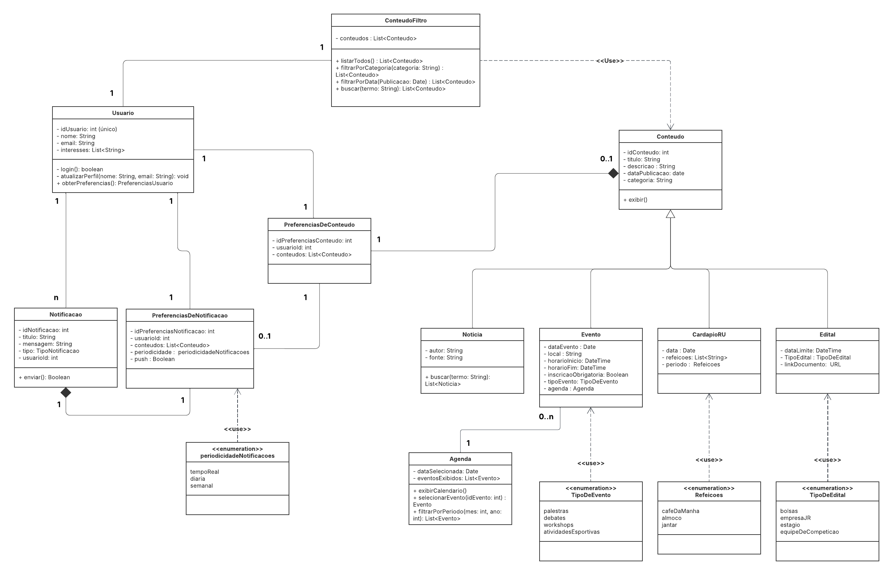

# 2.1.1 Diagrama de Classes

## Introdução

A modelagem de classes é uma etapa fundamental no desenvolvimento de sistemas orientados a objetos, pois possibilita representar de maneira estruturada e estática os principais elementos do sistema, suas características e os relacionamentos existentes entre eles.

Por meio do diagrama de classes, torna-se possível visualizar abstrações do mundo real em termos de entidades, atributos e comportamentos, além de compreender como essas entidades interagem entre si ([LUCIDCHART, 2026](https://www.lucidchart.com/pages/pt/o-que-e-diagrama-de-classe-uml)).

## Participantes

| Aluno  | Participação|
| -- | -- |
|  Arthur Guilherme Aquino Santos |  [Participação na realização do diagrama](https://unbarqdsw2026-1-turma01.github.io/2026.1-T01-_G4_FCTE_Hoje_Entrega_02/#/Modelagem/2.1.1.DiagramaClasses?id=diagrama-de-classes) |
|  Tiago Lemes Teixeira | Criação da documentação e [Participação na realização do diagrama](https://unbarqdsw2026-1-turma01.github.io/2026.1-T01-_G4_FCTE_Hoje_Entrega_02/#/Modelagem/2.1.1.DiagramaClasses?id=diagrama-de-classes) |
|  Vilmar José Fagundes  | [Participação na realização do diagrama](https://unbarqdsw2026-1-turma01.github.io/2026.1-T01-_G4_FCTE_Hoje_Entrega_02/#/Modelagem/2.1.1.DiagramaClasses?id=diagrama-de-classes) |

## Metodologia

A metodologia utilizada para a construção do diagrama de classes segue os princípios da **UML (Unified Modeling Language)**, linguagem amplamente adotada para modelagem de sistemas orientados a objetos.

Com base na análise dos requisitos levantados e na interpretação do protótipo, foi definida a estrutura das classes, incluindo seus atributos, métodos e os tipos de relacionamentos necessários, como associação, herança, agregação e composição ([UML-DIAGRAMS, 2026](https://www.uml-diagrams.org/class-diagrams-overview.html)).

O diagrama foi elaborado pelos integrantes [Arthur Guilherme Aquino Santos](https://github.com/ArthurGuilher62), [Tiago Lemes Teixeira](https://github.com/TiagoTeixeira-2005) e [Vilmar José Fagundes](https://github.com/VilmarFagundes) utilizando a ferramenta Lucidchart e tomando como referência o material disponibilizado pela professora Milene Serrano ([SERRANO, 2026](https://unbarqdsw2026-1-turma01.github.io/2026.1-T01-_G4_FCTE_Hoje_Entrega_02/Assets/Referencias/Ref_modelagem_UML_estatica.pdf)). Essa abordagem permitiu representar de forma clara, consistente e padronizada a arquitetura estrutural do sistema.

## Diagrama de Classes

<strong>Figura 1: Diagrama de Classes</strong>

<em>Autor: <a href="https://github.com/ArthurGuilher62">Arthur Guilherme</a>, <a href="https://github.com/TiagoTeixeira-2005">Tiago Lemes</a> e <a href="https://github.com/VilmarFagundes">Vilmar Fagundes</a></em>

</em>

## Referências Bibliográficas

> LUCIDCHART. O que é diagrama de classe UML. 2026. Disponível em: [Lucidchart](https://www.lucidchart.com/pages/pt/o-que-e-diagrama-de-classe-uml). Acesso em: 14 abr. 2026.
> 
> UML-DIAGRAMS. UML Class and Object Diagrams Overview. 2026. Disponível em: [UML-Diagrams](https://www.uml-diagrams.org/class-diagrams-overview.html). Acesso em: 14 abr. 2026.
> 
> SERRANO, Milene. AULA - MODELAGEM UML ESTÁTICA. [S.l.]: Milene Serrano, 2026. Disponível em: [AULA - MODELAGEM UML ESTÁTICA](https://unbarqdsw2026-1-turma01.github.io/2026.1-T01-_G4_FCTE_Hoje_Entrega_02/Assets/Referencias/Ref_modelagem_UML_estatica.pdf). Acesso em: 14 abr. 2026.

## Histórico de versões
| Versão | Data | Descrição | Autor(es) | Revisor(es) | Data da revisão |
|--------|------|-----------|-----------|-------------|-----------------|
| `1.0` | 14/04/2026 | Criação do documento. | [Tiago Lemes](https://github.com/TiagoTeixeira-2005) | [Vilmar Fagundes](https://github.com/VilmarFagundes) | 14/04/2026 |

