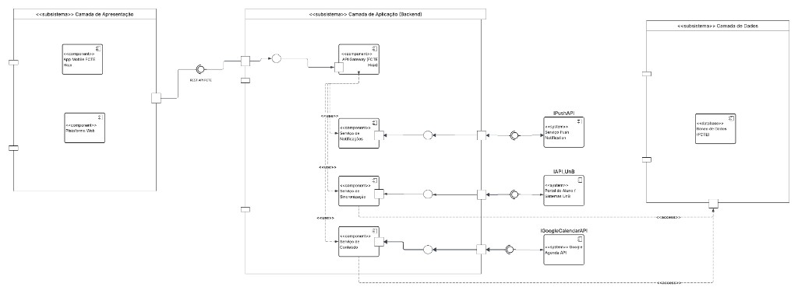

# 2.1.2 Diagrama de Componentes

## Introdução

O **diagrama de componentes** descreve a organização física e modular de um sistema de software, apresentando componentes reutilizáveis, **interfaces fornecidas e requeridas**, **portas** e as **dependências** entre eles. Esse tipo de diagrama é amplamente usado em arquiteturas orientadas a serviços e ao desenvolvimento baseado em componentes, pois explicita quais módulos existem, como se comunicam e quais partes do sistema dependem umas das outras ([UML-DIAGRAMS, 2026](https://www.uml-diagrams.org/component-diagrams.html)).

No contexto do **FCTE Hoje**, o diagrama consolida a visão de alto nível da solução: clientes (aplicação mobile e plataforma web), backend com **API Gateway** e serviços, persistência e integrações com sistemas externos (UnB, notificações push e Google Agenda).

## Participantes

| Aluno | Participação |
| -- | -- |
| [Felipe Lopes Pedroza](https://github.com/darkymeubem) | [Elaboração do diagrama e da documentação](https://unbarqdsw2026-1-turma01.github.io/2026.1-T01-_G4_FCTE_Hoje_Entrega_02/#/Modelagem/2.1.2.DiagramaComponentes) |
| [Felipe Matheus Ribeiro Lopes](https://github.com/femathrl0) | [Elaboração do diagrama e da documentação](https://unbarqdsw2026-1-turma01.github.io/2026.1-T01-_G4_FCTE_Hoje_Entrega_02/#/Modelagem/2.1.2.DiagramaComponentes) |
| [Pedro Miguel Martins de Oliveira dos Santos](https://github.com/pedromadbr) | [Elaboração do diagrama e da documentação](https://unbarqdsw2026-1-turma01.github.io/2026.1-T01-_G4_FCTE_Hoje_Entrega_02/#/Modelagem/2.1.2.DiagramaComponentes) |

## Metodologia

A modelagem segue a **UML** para componentes, interfaces e estereótipos (`<<component>>`, `<<system>>`, `<<database>>`, `<<use>>`, `<<access>>`), alinhada ao material de modelagem em camadas e às boas práticas de notação de interfaces fornecidas e requeridas ([UML-DIAGRAMS, 2026](https://www.uml-diagrams.org/component-diagrams.html)). O diagrama foi construído no **Lucidchart** com base nos requisitos do sistema, destacando a separação em subsistemas (apresentação, aplicação e dados) e a exposição de uma **API REST** comum às plataformas cliente.

A concepção apoia-se também no material de **modelagem UML estática** da disciplina, consolidando terminologia e relações de dependência e de acesso a dados de forma documentada e padronizada ([SERRANO, 2026](https://unbarqdsw2026-1-turma01.github.io/2026.1-T01-_G4_FCTE_Hoje_Entrega_02/Assets/Referencias/Ref_modelagem_UML_estatica.pdf)).

## Diagrama de Componentes

<strong>Figura 1: Diagrama de Componentes — FCTE Hoje</strong>

<em>Autor: <a href="https://github.com/darkymeubem">Felipe Pedroza</a>, <a href="https://github.com/femathrl0">Felipe Matheus</a> e <a href="https://github.com/pedromadbr">Pedro Miguel</a></em>

## Descrição do Diagrama de Componentes

Com base no diagrama, a arquitetura do **FCTE Hoje** está organizada em três **subsistemas** principais, da esquerda para a direita: **Camada de Apresentação**, **Camada de Aplicação (Backend)** e **Camada de Dados**, além de **sistemas externos** conectados por interfaces nomeadas.

- **Camada de Apresentação:** Abriga o **`App Mobile FCTE Hoje`** e a **`Plataforma Web`**, canais pelos quais o usuário acessa o sistema. A camada se conecta ao backend por meio da interface requerida **`REST API FCTE`**, representando o consumo de serviços via API REST comum a ambos os clientes (alinhada a requisitos de interface multiplataforma, como o **RNF01**).
- **Camada de Aplicação (Backend):** O ponto de entrada é o **`API Gateway (FCTE Hoje)`**, que recebe requisições autenticadas/roteadas após a interface **`REST API FCTE`**. Do Gateway partem dependências estereotipadas **`<<use>>`** em direção a três módulos de serviço: **`Serviço de Notificações`** (envio e orquestração de alertas e resumos, relacionado a **RF11**, **RF12** e **RNF02**), **`Serviço de Sincronização`** (atualização periódica e integração institucional, **RF09** e **RNF04**) e **`Serviço de Conteúdo`** (notícias, calendário, RU, editais, vida estudantil, **RF01**–**RF08** e **RF10**). Cada serviço expõe ou consome **interfaces** em relação a sistemas fora do núcleo da aplicação: **`IPushAPI`** (serviço de push), **`IAPIUnB`** (Portal do Aluno / sistemas UnB) e **`IGoogleCalendarAPI`** (exportação/agenda, **RF10**).
- **Camada de Dados:** O componente **`Banco de Dados (FCTE)`** concentra a persistência. Os serviços de **Sincronização** e de **Conteúdo** estabelecem dependências de acesso estereotipadas **`<<access>>`**, indicando leitura e gravação de dados em favor da sincronização, personalização, cache no servidor e consistência com o app.

Em conjunto, o diagrama mostra um fluxo coerente: **cliente → API REST → Gateway → serviços especializados → banco e integrações externas**, mantendo visível o que é interno ao produto e o que depende de plataformas de terceiros (UnB, Google, provedor de push).

## Referências Bibliográficas

> UML-DIAGRAMS. UML Component Diagrams. 2026. Disponível em: [UML-Diagrams — Component Diagrams](https://www.uml-diagrams.org/component-diagrams.html). Acesso em: 23 abr. 2026.
>
> SERRANO, Milene. AULA - MODELAGEM UML ESTÁTICA. [S.l.]: Milene Serrano, 2026. Disponível em: [AULA - MODELAGEM UML ESTÁTICA](https://unbarqdsw2026-1-turma01.github.io/2026.1-T01-_G4_FCTE_Hoje_Entrega_02/Assets/Referencias/Ref_modelagem_UML_estatica.pdf). Acesso em: 23 abr. 2026.

## Histórico de versões

| Versão | Data | Descrição | Autor(es) | Revisor(es) | Data da revisão |
|--------|------|-----------|-----------|-------------|-----------------|
| `1.0` | 23/04/2026 | Criação do documento com diagrama, descrição e referências. | [Felipe Pedroza](https://github.com/darkymeubem), [Felipe Matheus](https://github.com/femathrl0) e [Pedro Miguel](https://github.com/pedromadbr) | — | — |
