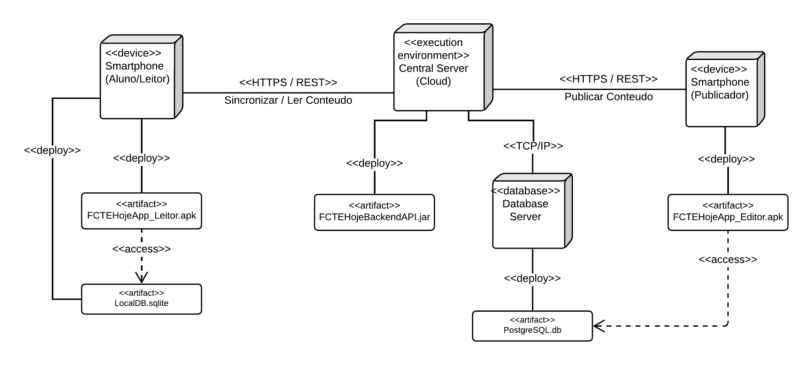

# 2.1.3 Diagrama de Implantação

## Introdução

A modelagem de implantação é uma etapa essencial no desenvolvimento de sistemas, pois permite representar a estrutura física da aplicação, evidenciando como os componentes de software são distribuídos nos elementos de hardware.

Por meio do diagrama de implantação, torna-se possível visualizar a arquitetura do sistema em tempo de execução, incluindo servidores, dispositivos, ambientes de execução e as conexões entre eles, garantindo uma melhor compreensão da infraestrutura necessária para suportar o sistema.

## Participantes

| Aluno  | Participação|
| -- | -- |
|  Arthur Gomes |[Participação na realização do diagrama](https://unbarqdsw2026-1-turma01.github.io/2026.1-T01-_G4_FCTE_Hoje_Entrega_02/#/Modelagem/2.1.3.DiagramaDeImplantacao) |
|  Arthur Henrique Vieira | Criação da documentação e [Participação na realização do diagrama](https://unbarqdsw2026-1-turma01.github.io/2026.1-T01-_G4_FCTE_Hoje_Entrega_02/#/Modelagem/2.1.3.DiagramaDeImplantacao) |
|  Felipe Guimarães | [Participação na realização do diagrama](https://unbarqdsw2026-1-turma01.github.io/2026.1-T01-_G4_FCTE_Hoje_Entrega_02/#/Modelagem/2.1.3.DiagramaDeImplantacao) |
|  Kauã Vale | [Participação na realização do diagrama](https://unbarqdsw2026-1-turma01.github.io/2026.1-T01-_G4_FCTE_Hoje_Entrega_02/#/Modelagem/2.1.3.DiagramaDeImplantacao) |

## Metodologia

A metodologia utilizada para a construção do diagrama de implantação segue os princípios da UML (Unified Modeling Language), amplamente utilizada para representar a arquitetura física de sistemas orientados a objetos.

Com base na definição da arquitetura do sistema e nos requisitos não funcionais, foram identificados os nós de hardware, os ambientes de execução e os artefatos de software, além das conexões entre esses elementos.

O diagrama foi elaborado pelos integrantes [Arthur Gomes](https://github.com/arthurgomes1290), [Arthur Henrique Vieira](https://github.com/arthurhvieira1), [Felipe Guimarães](https://github.com/felipegf1) e [Kauã Vale Leão](https://github.com/KauaVL)  utilizando a ferramenta Lucidchart e tomando como referência o material disponibilizado pela professora Milene Serrano ([SERRANO, 2026](https://unbarqdsw2026-1-turma01.github.io/2026.1-T01-_G4_FCTE_Hoje_Entrega_02/Assets/Referencias/Ref_modelagem_UML_estatica.pdf)). Essa abordagem permitiu representar de forma clara, consistente e padronizada a arquitetura estrutural do sistema.

## Diagrama de Implantação

<strong>Figura 1: Diagrama de Implantação</strong>

<em>Autor: <a href="https://github.com/arthurgomes1290">Arthur Gomes</a>, <a href="https://github.com/arthurhvieira1">Arthur Henrique</a>, <a href="https://github.com/felipegf1">Felipe Guimarães</a> e <a href="https://github.com/KauaVL">Kauã Vale</a></em>

</em>

## Descrição do Diagrama de Implantação

Com base no **Diagrama de Implantação** desenvolvido acima, esta seção descreve a estrutura física do sistema, detalhando os nós de execução, os artefatos implantados e as formas de comunicação entre os componentes.

- **Dispositivo do Usuário (Cliente):** Representa o ambiente onde o usuário acessa o sistema, podendo ser um navegador web ou aplicativo mobile. É responsável por requisitar dados ao servidor e exibir as informações ao usuário por meio da interface gráfica.

- **Servidor Web:** Responsável por hospedar a aplicação backend e gerenciar as requisições HTTP provenientes dos clientes. Processa as regras de negócio, autenticação de usuários e comunicação com o banco de dados.

- **Aplicação Backend:** Artefato implantado no servidor web, desenvolvido em Python utilizando frameworks leves como Bottle. Contém a lógica do sistema, incluindo gerenciamento de usuários, conteúdos, notificações e preferências.

- **Banco de Dados:** Responsável pelo armazenamento persistente das informações do sistema, como usuários, conteúdos, eventos e preferências. É acessado pelo backend por meio de consultas e operações de leitura e escrita.

- **Serviço de Notificações:** Componente responsável pelo envio de notificações aos usuários, podendo utilizar serviços externos (como APIs de push notifications). Está integrado ao backend e atua conforme as preferências definidas pelo usuário.

- **Rede (Internet):** Meio de comunicação que interliga o dispositivo do usuário ao servidor, permitindo a troca de dados por meio de protocolos como HTTP/HTTPS.

- **API Externa (Opcional):** Representa serviços de terceiros que podem ser integrados ao sistema, como serviços de autenticação, envio de e-mails ou notificações push.

## Referências Bibliográficas

> LUCIDCHART. O que é diagrama de classe UML. 2026. Disponível em: [Lucidchart](https://www.lucidchart.com/pages/pt/o-que-e-diagrama-de-classe-uml). Acesso em: 14 abr. 2026.
> 
> UML-DIAGRAMS. UML Class and Object Diagrams Overview. 2026. Disponível em: [UML-Diagrams](https://www.uml-diagrams.org/class-diagrams-overview.html). Acesso em: 14 abr. 2026.
> 
> SERRANO, Milene. AULA - MODELAGEM UML ESTÁTICA. [S.l.]: Milene Serrano, 2026. Disponível em: [AULA - MODELAGEM UML ESTÁTICA](https://unbarqdsw2026-1-turma01.github.io/2026.1-T01-_G4_FCTE_Hoje_Entrega_02/Assets/Referencias/Ref_modelagem_UML_estatica.pdf). Acesso em: 14 abr. 2026.

## Histórico de versões
| Versão | Data | Descrição | Autor(es) | Revisor(es) | Data da revisão |
|--------|------|-----------|-----------|-------------|-----------------|
| `1.0` | 14/04/2026 | Criação do documento. | [Tiago Lemes](https://github.com/TiagoTeixeira-2005) | [Vilmar Fagundes](https://github.com/VilmarFagundes) | 14/04/2026 |
| `1.1` | 19/04/2026 | Upload dos textos acerca do Diagrama de Implantação. | [Arthur Henrique](https://github.com/arthurhvieira1) | [Kauã Vale](https://github.com/KauaVL) | 19/04/2026 |

