# 2.2.1 Diagrama de Sequência

## Introdução

Os diagramas de sequência na UML são usados principalmente para modelar as interações entre os atores e os objetos de um sistema, bem como as interações entre os próprios objetos. A UML tem uma sintaxe rica para diagramas de sequência, que permite modelar muitos tipos diferentes de interações. *(SOMMERVILLE, 2011, p. 96)*

Esses diagramas representam a ordem temporal das mensagens trocadas entre os participantes de um cenário, evidenciando o comportamento dinâmico do sistema a partir dos casos de uso já modelados.

## Participantes

| Aluno  | Participação|
| -- | -- |
|  Arthur Henrique Vieira |  [Participação na realização do diagrama](https://unbarqdsw2026-1-turma01.github.io/2026.1-T01-_G4_FCTE_Hoje_Entrega_02/#/Modelagem/2.2.1.DiagramaDeSequencia?id=diagrama-de-sequência) |
|  Kauã Vale Leão |  Criação da documentação e [participação na realização do diagrama](https://unbarqdsw2026-1-turma01.github.io/2026.1-T01-_G4_FCTE_Hoje_Entrega_02/#/Modelagem/2.2.1.DiagramaDeSequencia?id=diagrama-de-sequência) |

## Objetivo

Representar, de forma temporal, as interações entre os atores e os componentes do sistema **FCTE Hoje** para cada caso de uso identificado, evidenciando a ordem das mensagens trocadas, os fluxos principais e os participantes envolvidos em cada cenário.

## Metodologia

Para a criação dos diagramas, foi utilizada a notação padrão da **UML**. A metodologia consistiu nos seguintes passos:

- **Análise dos Casos de Uso:** Cada diagrama foi construído a partir do mapeamento de casos de uso definido em [2.3.1 Diagrama de Casos de Uso](2.3.1.DiagramaDeCasosDeUso.md), garantindo rastreabilidade entre os artefatos;
- **Identificação dos participantes:** Definição dos atores e dos componentes envolvidos em cada interação (telas, banco de dados e sistemas externos);
- **Modelagem das mensagens:** Representação da troca de mensagens entre participantes, na ordem temporal em que ocorrem, distinguindo chamadas (linha contínua) e retornos (linha tracejada);
- **Padronização visual:** Os diagramas foram elaborados em estilo de **alto nível**, focando no fluxo essencial de cada caso de uso, sem detalhar camadas internas (controller/service/repository).

## Diagramas de Sequência

A seguir são apresentados os 16 diagramas de sequência produzidos nesta entrega, organizados por **agrupamento funcional** para facilitar a leitura:

1. **Visualização de Conteúdo** — fluxos de leitura (UC01–UC04)
2. **Interação com Conteúdo** — ações sobre o conteúdo exibido (UC05, UC06)
3. **Preferências e Notificações** — configuração de perfil e recebimento de avisos (UC07–UC09)
4. **Agenda e Integração Externa** — fluxos de eventos e exportação (UC10, UC11)
5. **Publicador** — operações do publicador sobre as próprias publicações (UC12–UC16)

---

### 1. Visualização de Conteúdo

Diagramas correspondentes aos casos de uso de leitura/consulta de conteúdo do sistema.

<strong>Figura 1: Diagrama de Sequência - UC01: Visualizar Cardápio RU</strong>

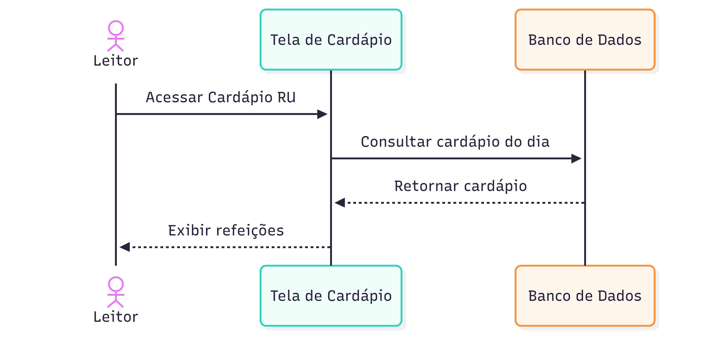

<em>Autor: <a href="https://github.com/arthurhvieira1">Arthur Henrique</a> e <a href="https://github.com/KauaVL">Kauã Vale</a></em>

---

<strong>Figura 2: Diagrama de Sequência - UC02: Visualizar Notícias</strong>

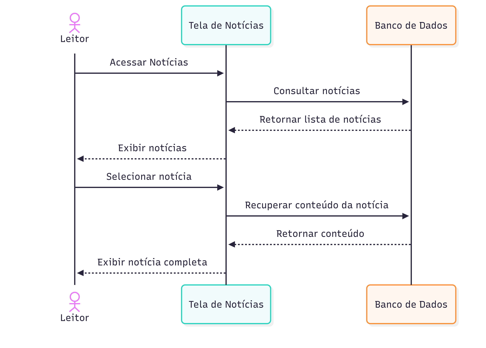

<em>Autor: <a href="https://github.com/arthurhvieira1">Arthur Henrique</a> e <a href="https://github.com/KauaVL">Kauã Vale</a></em>

---

<strong>Figura 3: Diagrama de Sequência - UC03: Visualizar Editais</strong>

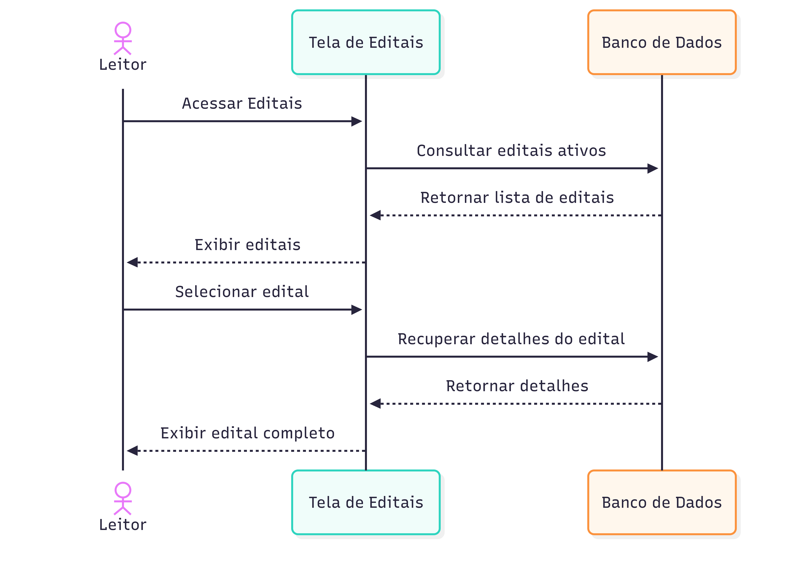

<em>Autor: <a href="https://github.com/arthurhvieira1">Arthur Henrique</a> e <a href="https://github.com/KauaVL">Kauã Vale</a></em>

---

<strong>Figura 4: Diagrama de Sequência - UC04: Visualizar Eventos</strong>

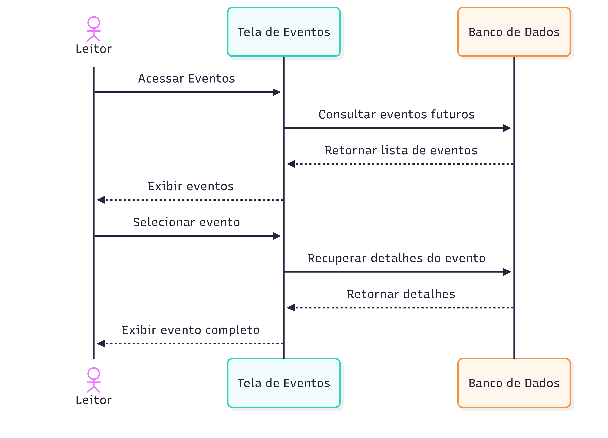

<em>Autor: <a href="https://github.com/arthurhvieira1">Arthur Henrique</a> e <a href="https://github.com/KauaVL">Kauã Vale</a></em>

---

### 2. Interação com Conteúdo

Diagramas das ações que o leitor pode realizar **sobre** o conteúdo já exibido.

<strong>Figura 5: Diagrama de Sequência - UC05: Filtrar Conteúdo</strong>

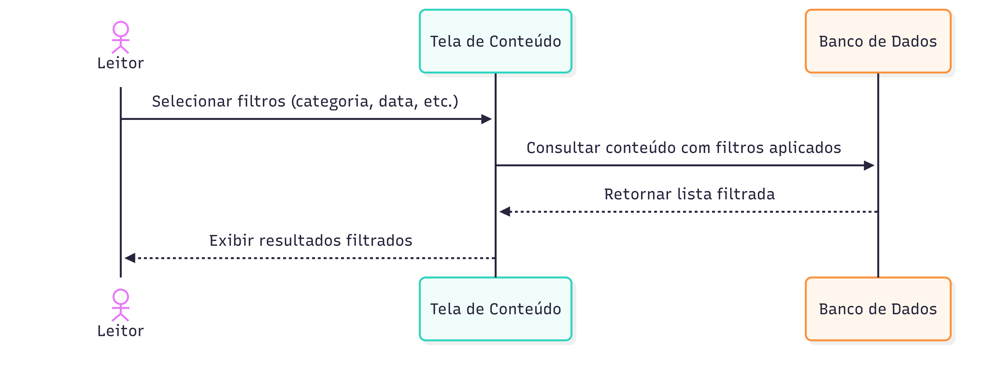

<em>Autor: <a href="https://github.com/arthurhvieira1">Arthur Henrique</a> e <a href="https://github.com/KauaVL">Kauã Vale</a></em>

---

<strong>Figura 6: Diagrama de Sequência - UC06: Salvar Informação</strong>

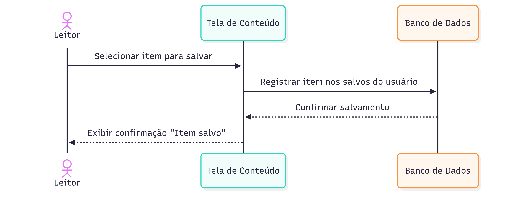

<em>Autor: <a href="https://github.com/arthurhvieira1">Arthur Henrique</a> e <a href="https://github.com/KauaVL">Kauã Vale</a></em>

---

### 3. Preferências e Notificações

Diagramas de configuração do perfil do leitor e do recebimento de notificações pelo sistema.

<strong>Figura 7: Diagrama de Sequência - UC07: Configurar Preferência de Conteúdo</strong>

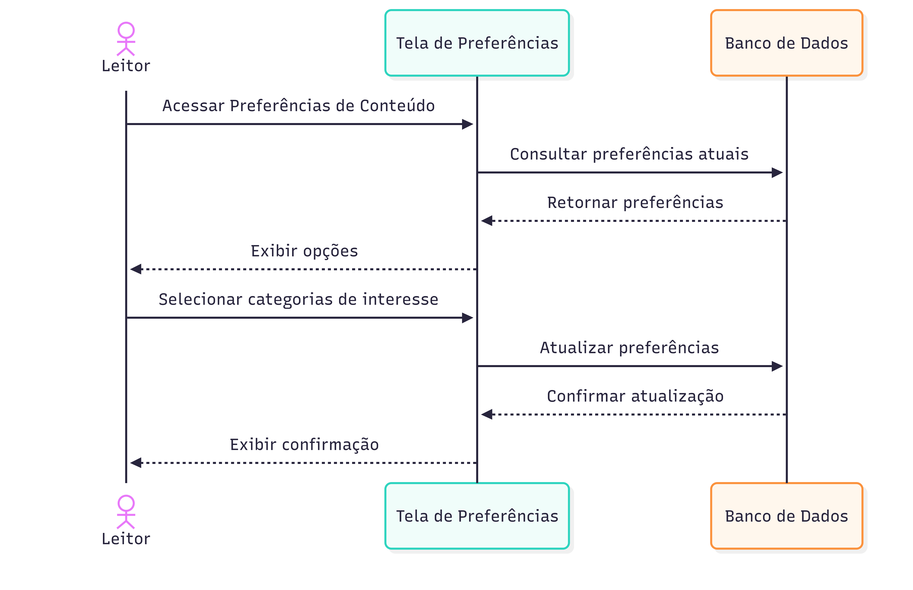

<em>Autor: <a href="https://github.com/arthurhvieira1">Arthur Henrique</a> e <a href="https://github.com/KauaVL">Kauã Vale</a></em>

---

<strong>Figura 8: Diagrama de Sequência - UC08: Configurar Preferência de Notificação</strong>

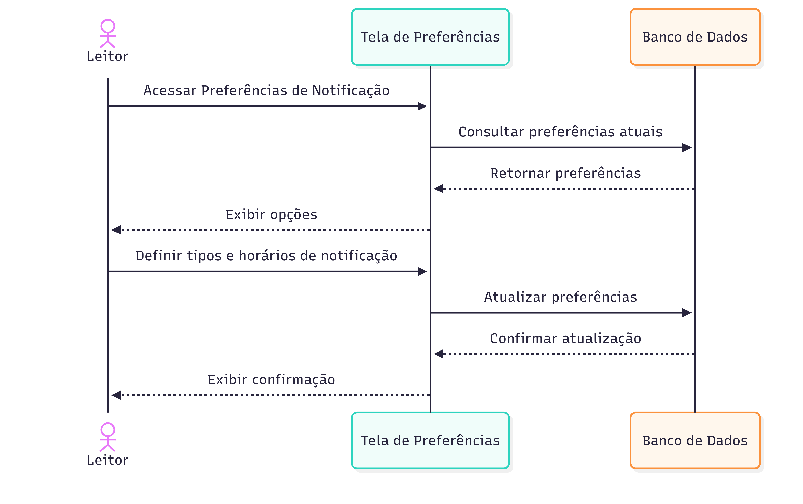

<em>Autor: <a href="https://github.com/arthurhvieira1">Arthur Henrique</a> e <a href="https://github.com/KauaVL">Kauã Vale</a></em>

---

<strong>Figura 9: Diagrama de Sequência - UC09: Receber Notificações</strong>

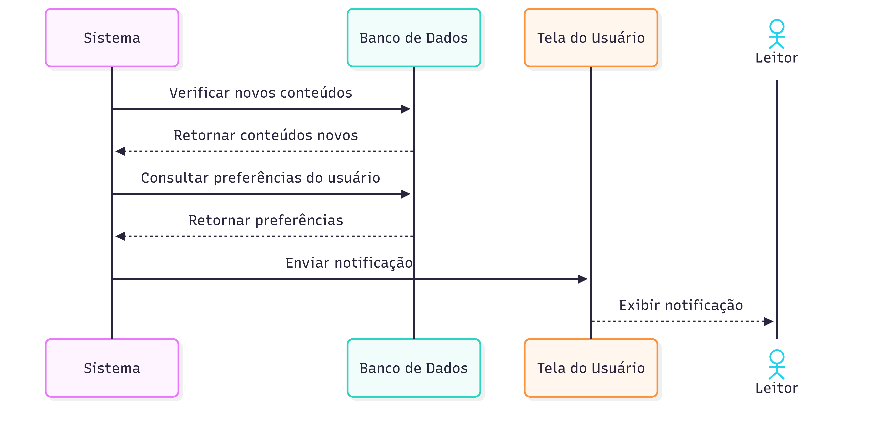

<em>Autor: <a href="https://github.com/arthurhvieira1">Arthur Henrique</a> e <a href="https://github.com/KauaVL">Kauã Vale</a></em>

---

### 4. Agenda e Integração Externa

Diagramas de consulta da agenda pessoal do leitor e de exportação de eventos para o **Google Agenda**.

<strong>Figura 10: Diagrama de Sequência - UC10: Ver Agenda</strong>

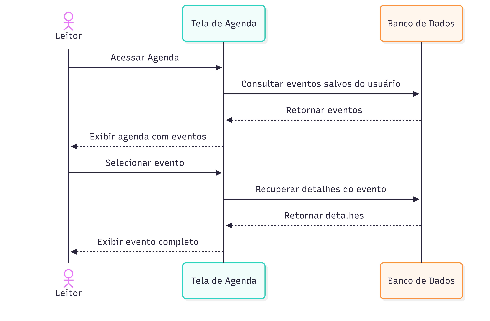

<em>Autor: <a href="https://github.com/arthurhvieira1">Arthur Henrique</a> e <a href="https://github.com/KauaVL">Kauã Vale</a></em>

---

<strong>Figura 11: Diagrama de Sequência - UC11: Exportar Eventos</strong>

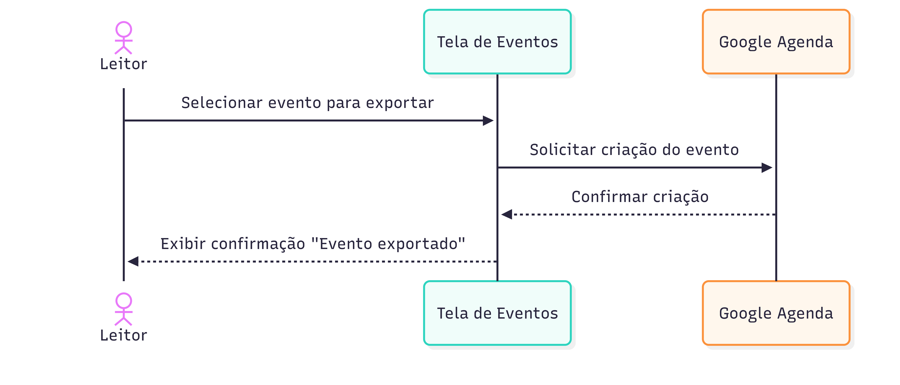

<em>Autor: <a href="https://github.com/arthurhvieira1">Arthur Henrique</a> e <a href="https://github.com/KauaVL">Kauã Vale</a></em>

---

### 5. Publicador

Diagramas das operações do publicador sobre as próprias publicações.

<strong>Figura 12: Diagrama de Sequência - UC12: Publicar</strong>

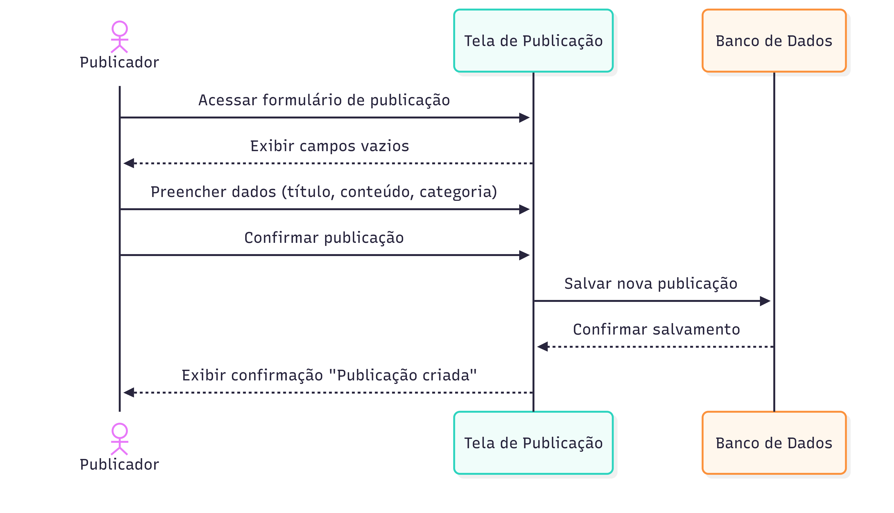

<em>Autor: <a href="https://github.com/arthurhvieira1">Arthur Henrique</a> e <a href="https://github.com/KauaVL">Kauã Vale</a></em>

---

<strong>Figura 13: Diagrama de Sequência - UC13: Visualizar Minhas Publicações</strong>

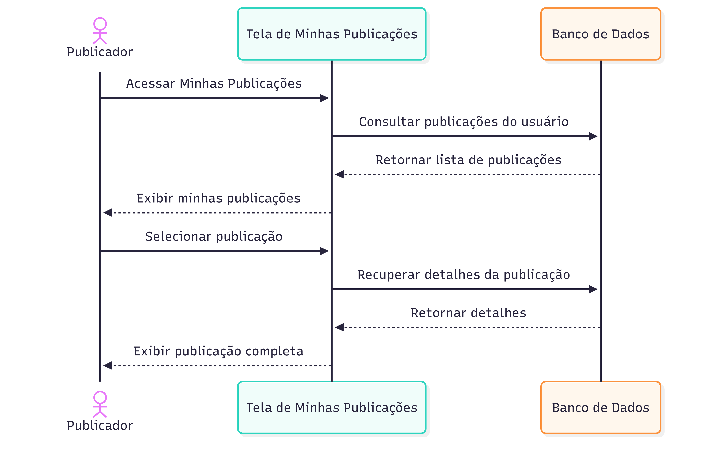

<em>Autor: <a href="https://github.com/arthurhvieira1">Arthur Henrique</a> e <a href="https://github.com/KauaVL">Kauã Vale</a></em>

---

<strong>Figura 14: Diagrama de Sequência - UC14: Editar Minhas Publicações</strong>

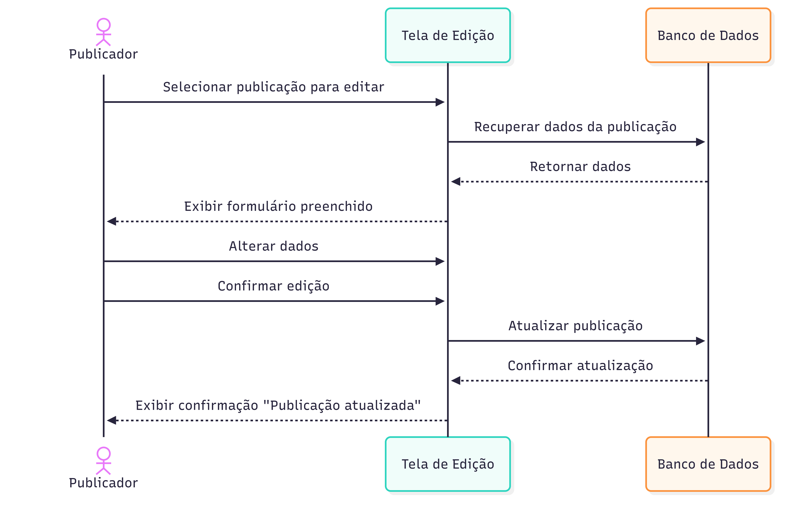

<em>Autor: <a href="https://github.com/arthurhvieira1">Arthur Henrique</a> e <a href="https://github.com/KauaVL">Kauã Vale</a></em>

---

<strong>Figura 15: Diagrama de Sequência - UC15: Excluir Minhas Publicações</strong>

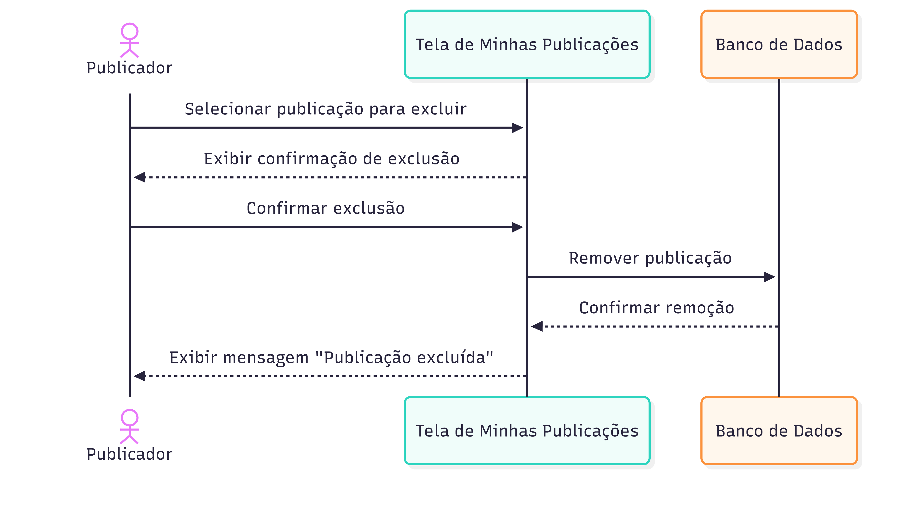

<em>Autor: <a href="https://github.com/arthurhvieira1">Arthur Henrique</a> e <a href="https://github.com/KauaVL">Kauã Vale</a></em>

---

<strong>Figura 16: Diagrama de Sequência - UC16: Gerenciar Publicações</strong>

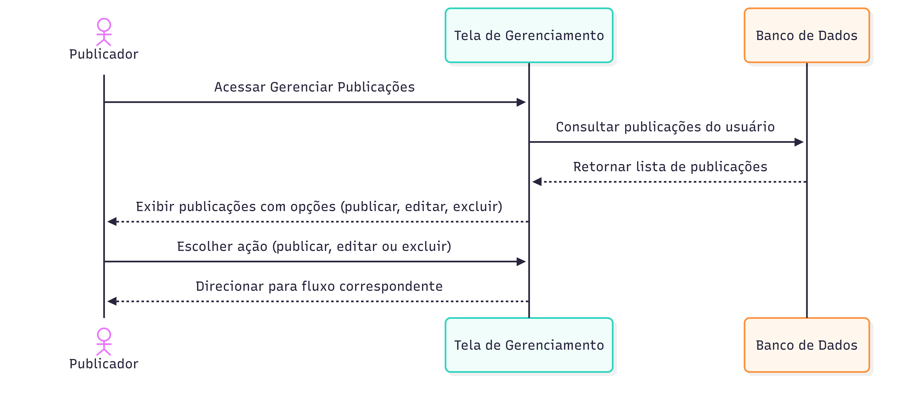

<em>Autor: <a href="https://github.com/arthurhvieira1">Arthur Henrique</a> e <a href="https://github.com/KauaVL">Kauã Vale</a></em>

## Mapeamento Diagrama × Caso de Uso

| Figura | Diagrama de Sequência | Caso de Uso de Origem | Ator Principal |
| -- | -- | -- | -- |
| 1 | Visualizar Cardápio RU | UC01 | Leitor |
| 2 | Visualizar Notícias | UC02 | Leitor |
| 3 | Visualizar Editais | UC03 | Leitor |
| 4 | Visualizar Eventos | UC04 | Leitor |
| 5 | Filtrar Conteúdo | UC05 | Leitor |
| 6 | Salvar Informação | UC06 | Leitor |
| 7 | Configurar Preferência de Conteúdo | UC07 | Leitor |
| 8 | Configurar Preferência de Notificação | UC08 | Leitor |
| 9 | Receber Notificações | UC09 | Sistema |
| 10 | Ver Agenda | UC10 | Leitor |
| 11 | Exportar Eventos | UC11 | Leitor / Google Agenda |
| 12 | Publicar | UC12 | Publicador |
| 13 | Visualizar Minhas Publicações | UC13 | Publicador |
| 14 | Editar Minhas Publicações | UC14 | Publicador |
| 15 | Excluir Minhas Publicações | UC15 | Publicador |
| 16 | Gerenciar Publicações | UC16 | Publicador |

## Conclusão

A elaboração dos Diagramas de Sequência permitiu detalhar, em uma camada de comportamento dinâmico, as interações já identificadas nos casos de uso do sistema **FCTE Hoje**. A organização por **agrupamento funcional** (visualização, interação, preferências, agenda/integração externa e publicador) facilita a leitura do conjunto e evidencia que a maioria dos fluxos atuais segue um padrão consistente: o ator solicita uma ação à tela, a tela consulta ou atualiza o banco de dados, e o resultado é devolvido ao ator.

A adoção de um nível de abstração mais alto, sem detalhar camadas internas como controllers e serviços, manteve o foco no que é relevante para a etapa de modelagem: a **ordem das interações** e os **participantes envolvidos**. Casos especiais como o **UC09 (Receber Notificações)**, iniciado pelo próprio Sistema, e o **UC11 (Exportar Eventos)**, que envolve integração com o **Google Agenda**, ficam visualmente distintos do padrão geral, o que ajuda a identificar pontos de atenção para a arquitetura. Em conjunto com o mapeamento de casos de uso, esses 16 diagramas formam uma base sólida para que as próximas iterações do projeto evoluam para diagramas mais detalhados (classes, componentes) sem perder rastreabilidade com os requisitos.

## Referências

> SOMMERVILLE, Ian. Engenharia de software. 9. ed. São Paulo: Pearson Prentice Hall, 2011. Disponível em: [SOMMERVILLE, 2011](https://archive.org/details/sommerville-engenharia-de-software-9a/mode/2up). Acesso em: 22 abr. 2026.

| Versão | Data | Descrição | Autor(es) | Revisor(es) | Data da revisão |
|--------|------|-----------|-----------|-------------|-----------------|
| `1.0` | 22/04/2026 | Criação do documento e adição dos 16 Diagramas de Sequência (UC01–UC16). | [Kauã Vale](https://github.com/KauaVL) | | |
