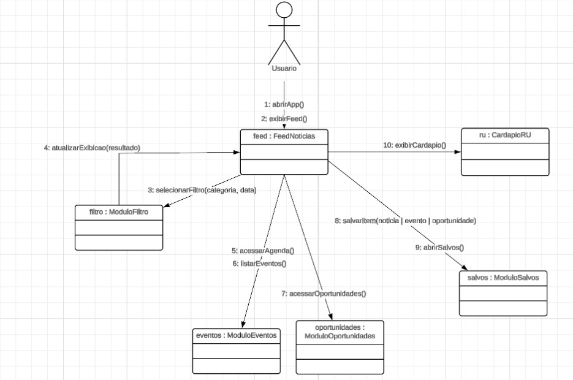

# 2.2.2 Diagrama de Comunicação

# Diagrama de Comunicação

## Introdução

O diagrama de comunicação (anteriormente conhecido como diagrama de colaboração) é um diagrama comportamental da UML. Ele foca na interação entre os objetos do sistema, destacando os vínculos estruturais e a sequência de mensagens trocadas para realizar uma funcionalidade específica.

Diferente do diagrama de sequência, que foca no tempo, o diagrama de comunicação prioriza a visão da arquitetura e as relações diretas entre os componentes envolvidos na execução de um caso de uso.

## Participantes

| Aluno  | Participação |
| -- | -- |
| Felipe Guimarães | Participação na elaboração do diagrama e documentação |
| Felipe Matheus | Participação na elaboração do diagrama e documentação |

## Metodologia

O diagrama foi construído seguindo os padrões da **UML (Unified Modeling Language)** para representar visualmente a troca de mensagens entre o Ator (Usuário) e as instâncias dos módulos do sistema. 

A modelagem focou no fluxo principal de navegação e nas ações primárias do usuário na interface, mapeando quais módulos recebem as requisições e como o sistema reage. A ferramenta utilizada para o desenho estrutural foi o Lucidchart.

## Diagrama de Comunicação

<strong>Figura 1: Diagrama de Comunicação</strong>

<em>Autor: <a href="#">Nome 1</a>, <a href="#">Nome 2</a> e <a href="#">Nome 3</a></em>

## Descrição das Ações do Usuário

O diagrama ilustra o fluxo de navegação e interação do usuário com os diferentes módulos do aplicativo:

* **1: abrirApp()**: O Ator (Usuário) inicia a interação abrindo o aplicativo, acionando o módulo central `feed : FeedNoticias`.
* **2: exibirFeed()**: O próprio módulo `FeedNoticias` realiza uma chamada interna para carregar e exibir as informações na tela inicial.
* **3: selecionarFiltro(categoria, data)**: A partir do Feed, ocorre uma interação com `filtro : ModuloFiltro` para buscar conteúdos específicos com base em categorias e datas.
* **4: atualizarExibicao(resultado)**: Após o processamento do filtro, o `ModuloFiltro` devolve os resultados para o `FeedNoticias`, que atualiza a tela do usuário.
* **5: acessarAgenda()**: O sistema envia uma requisição para o `eventos : ModuloEventos` quando o usuário decide visualizar a agenda acadêmica.
* **6: listarEventos()**: Chamada interna no `ModuloEventos` para processar e apresentar a lista de eventos agendados.
* **7: acessarOportunidades()**: A partir do módulo central, o sistema aciona o `oportunidades : ModuloOportunidades` para exibir editais e vagas.
* **8: salvarItem(noticia | evento | oportunidade)**: O usuário envia um comando para salvar um conteúdo de interesse, interagindo com o `salvos : ModuloSalvos`.
* **9: abrirSalvos()**: Chamada direta ao `ModuloSalvos` para visualizar a lista de todos os itens guardados pelo usuário.
* **10: exibirCardapio()**: O sistema se comunica com o `ru : CardapioRU` para recuperar e exibir as informações das refeições do restaurante universitário.

## Referências Bibliográficas

> LUCIDCHART. O que é um diagrama de comunicação UML. Disponível em: [Lucidchart](https://www.lucidchart.com/). Acesso em: 22 abr. 2026.
> 
> UML-DIAGRAMS. Communication Diagrams. Disponível em: [UML-Diagrams](https://www.uml-diagrams.org/communication-diagrams.html). Acesso em: 22 abr. 2026.
>
> WHAT IS COMMUNICATION DIAGRAM?. UML Communication Diagrams. [What is Communication Diagram?](https://www.visual-paradigm.com/guide/uml-unified-modeling-language/what-is-communication-diagram/). Acesso em: 22 abr. 2026.

## Histórico de versões

| Versão | Data | Descrição | Autor(es) | Revisor(es) | Data da revisão |
|--------|------|-----------|-----------|-------------|-----------------|
| `1.0` | 22/04/2026 | Criação e revisão da documentação do diagrama de comunicação. | Felipe Matheus | Felipe Guimarães | 22/04/2026 |
