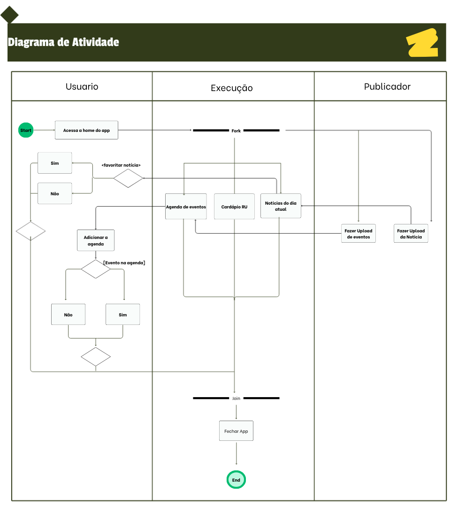

# 2.2.3 Diagrama de Atividades

## Introdução

O diagrama de atividades é uma representação comportamental da UML utilizada para descrever o fluxo de execução de um processo, destacando a sequência de ações, condições de decisão, paralelismo e sincronização entre etapas.

Nesse tipo de diagrama, o foco está em como o trabalho acontece ao longo do tempo, quem executa cada parte e em quais pontos o fluxo pode se dividir ou convergir, facilitando a compreensão do comportamento do sistema e das interações entre atores ([SERRANO, 2026](https://unbarqdsw2026-1-turma01.github.io/2026.1-T01-_G4_FCTE_Hoje_Entrega_02/Assets/Referencias/Ref_Modelagem_UML_Dinamica.pdf)).

## Participantes

| Aluno | Participação |
| -- | -- |
| Arthur Gomes | Contribuição na elaboração do [Diagrama de Atividades](https://unbarqdsw2026-1-turma01.github.io/2026.1-T01-_G4_FCTE_Hoje_Entrega_02/#/Modelagem/2.2.3.DiagramaDeAtividades?id=diagrama-de-atividades) |
| Felipe Pedroza | Criação da documentação e contribuição na elaboração do [Diagrama de Atividades](https://unbarqdsw2026-1-turma01.github.io/2026.1-T01-_G4_FCTE_Hoje_Entrega_02/#/Modelagem/2.2.3.DiagramaDeAtividades?id=diagrama-de-atividades) |
| Felipe Pedroza | Contribuição na elaboração do [Diagrama de Atividades](https://unbarqdsw2026-1-turma01.github.io/2026.1-T01-_G4_FCTE_Hoje_Entrega_02/#/Modelagem/2.2.3.DiagramaDeAtividades?id=diagrama-de-atividades) |

## Metodologia

A metodologia adotada para a construção do diagrama de atividades seguiu os princípios da **UML (Unified Modeling Language)**, com ênfase na modelagem de fluxo de controle e de objetos em cenários com múltiplos participantes.

Primeiro, foi definido o fluxo principal da funcionalidade representada no diagrama, identificando início e fim do processo, pontos de decisão, atividades concorrentes, sincronização e responsabilidades de cada participante por meio de swimlanes. Em seguida, os elementos foram organizados para garantir legibilidade, coerência semântica e padronização da notação.

Para apoiar a modelagem, foram utilizadas as referências sobre atividade UML e notação de ações, especialmente para diferenciar corretamente elementos de **action, object e control** ([Activity Diagrams, 2026](https://www.uml-diagrams.org/activity-diagrams.html#google_vignette)).

## Diagrama de Atividades

A figura abaixo representa o Diagrama de Atividades, que também pode ser visualizado no Canva por meio deste [link](https://canva.link/uk4hdknzn2e7i1a).

<strong>Figura 1: Diagrama de Atividades</strong>

<em>Autor: <a href="https://github.com/arthurgomes1290">Arthur Gomes</a>, <a href="https://github.com/darkymeubem">Felipe Lopes Pedroza</a>, e <a href="https://github.com/pedromadbr">Pedro Miguel</a></em>

## Descrição do Diagrama de Atividades

Com base no diagrama apresentado, o fluxo descreve o comportamento do sistema desde a entrada do usuário no aplicativo até o encerramento da execução, distribuindo as responsabilidades entre os participantes representados nas swimlanes.

- **Swimlanes (raias):** O diagrama está dividido em três swimlanes (`Usuario`, `Execucao` e `Publicador`). Cada raia delimita a responsabilidade de quem executa cada etapa do processo.
- **Início (nó inicial):** O círculo preenchido em verde no topo esquerdo representa o ponto de partida do fluxo, quando o usuário acessa a área principal do aplicativo.
- **Ações (action):** Os retângulos com cantos arredondados representam ações atômicas do fluxo, como acessar a tela, verificar conteúdos, aguardar evento e fechar o aplicativo.
- **Objetos (object):** Elementos que representam informações manipuladas ou disponibilizadas durante o fluxo, como cardápio RU, notícias e eventos, consumidos pelo usuário ao longo da execução.
- **Controles (control):** Elementos de controle do fluxo, incluindo decisões (losangos), fork e join. As decisões definem caminhos alternativos (por exemplo, sim/não), o fork divide o fluxo em execuções paralelas e o join sincroniza esses caminhos antes da finalização.
- **Fim (nó final):** O círculo com borda (alvo) em verde na parte inferior indica o encerramento do processo após a conclusão das atividades.

### Action, Object e Control no contexto do diagrama

- **Action:** Representa uma atividade executável e indivisível no contexto do fluxo. No diagrama, cada ação modela um passo operacional (ex.: abrir tela, consultar conteúdo, finalizar processo).
- **Object:** Representa dados ou artefatos que transitam entre etapas e apoiam as ações. No diagrama, os conteúdos exibidos ao usuário funcionam como objetos de informação utilizados no processo.
- **Control:** Representa a lógica de coordenação da execução, sem carregar dados de negócio em si. Decisão, fork, join, início e fim são controles que organizam a ordem, as condições e a concorrência do fluxo.

## Referências Bibliográficas

> UML-DIAGRAMS. UML Activity Diagrams Overview. 2026. Disponível em: [UML-Diagrams - Activity Diagrams](https://www.uml-diagrams.org/activity-diagrams.html#google_vignette). Acesso em: 21 abr. 2026.
> 
> UML-DIAGRAMS. UML Activity Diagrams - Actions. 2026. Disponível em: [UML-Diagrams - Actions](https://www.uml-diagrams.org/activity-diagrams-actions.html). Acesso em: 21 abr. 2026.
> 
> SERRANO, Milene. AULA - MODELAGEM UML DINÂMICA. [S.l.]: Milene Serrano, 2026. Disponível em: [AULA - MODELAGEM UML DINÂMICA](https://unbarqdsw2026-1-turma01.github.io/2026.1-T01-_G4_FCTE_Hoje_Entrega_02/Assets/Referencias/Ref_Modelagem_UML_Dinamica.pdf). Acesso em: 22 abr. 2026.

## Histórico de versões
| Versão | Data | Descrição | Autor(es) | Revisor(es) | Data da revisão |
|--------|------|-----------|-----------|-------------|-----------------|
| `1.0` | 21/04/2026 | Criação do documento padronizado de diagrama de atividades com imagem, metodologia e descrição dos elementos UML. | [Felipe Pedroza](https://github.com/darkymeubem) | Arthur Gomes e Pedro Miguel | 21/04/2026 |
| `1.1` | 22/04/2026 | Correção das citações e das referências bibliográficas. | [Tiago Lemes](https://github.com/TiagoTeixeira-2005)| |  |
