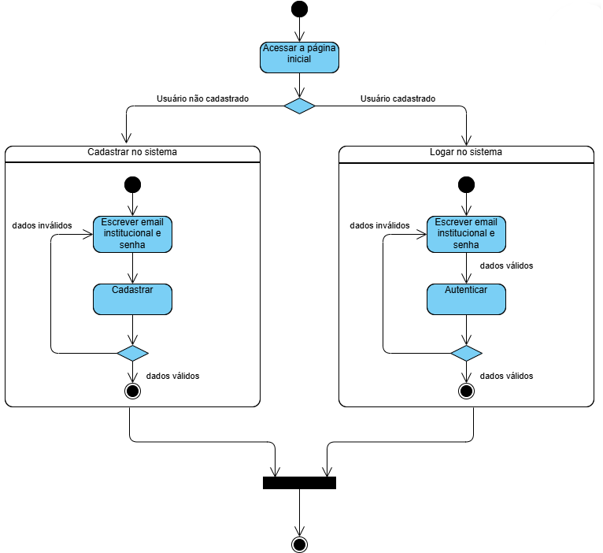
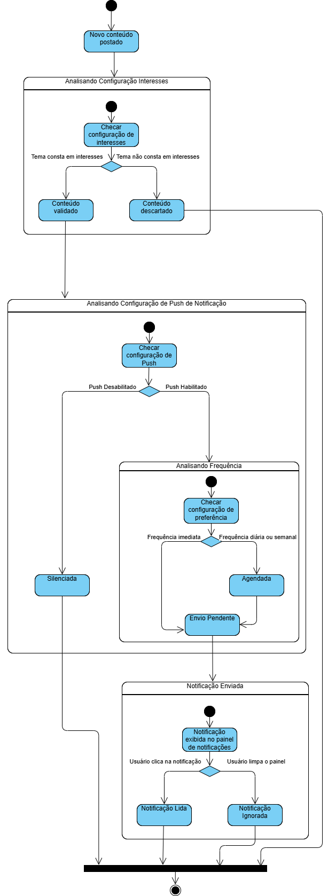
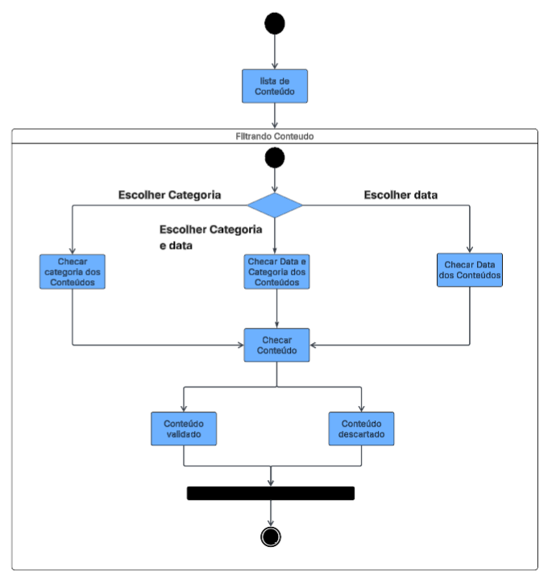
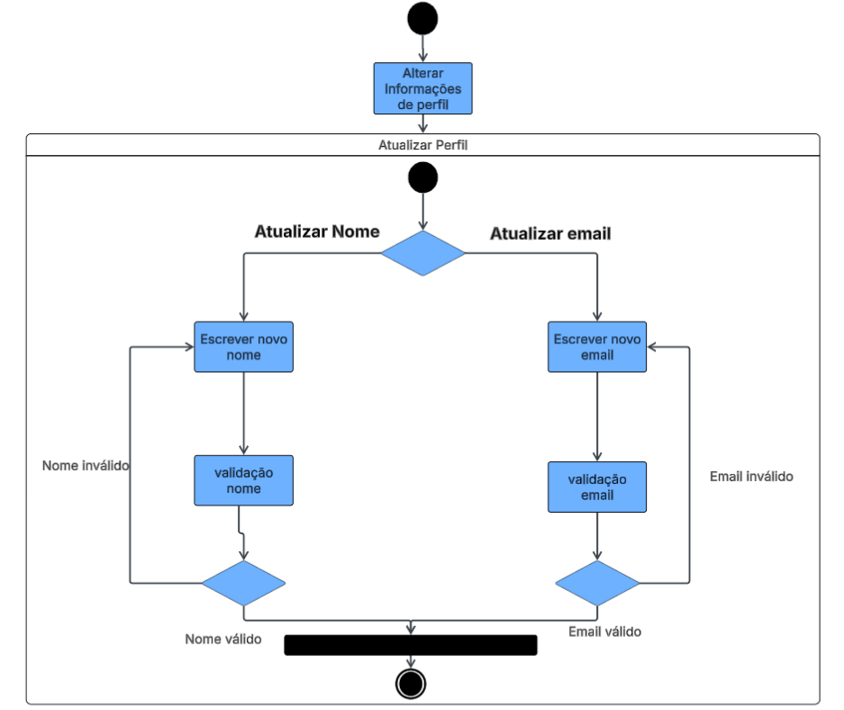
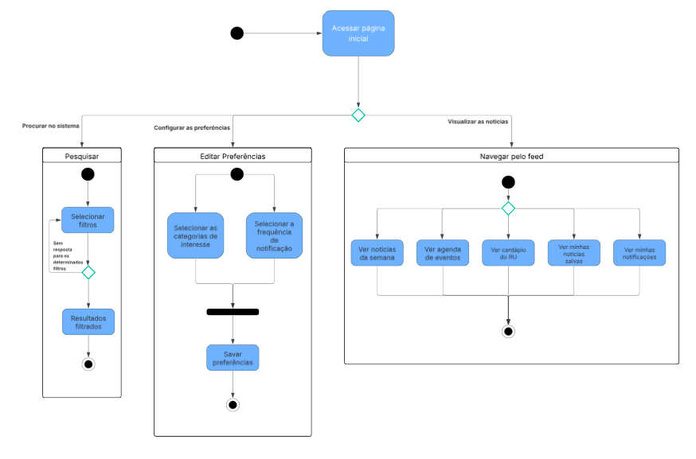

# 2.2.4 Diagrama de Estado

## Introdução

O Diagrama de Estado, também é um diagrama dinâmico. Esse procura apresentar os vários estados pelos quais um objeto pode passar. Ao longo do tempo, um objeto muda de estado quando acontece algum evento interno ou externo ao sistema. ([SERRANO, 2026](https://github.com/UnBArqDsw2026-1-Turma01/2026.1-T01-_G4_FCTE_Hoje_Entrega_02/blob/main/docs/Assets/Referencias/Ref_Modelagem_UML_Dinamica.pdf))

## Participantes

| Aluno  | Participação|
| -- | -- |
|  Arthur Guilherme Aquino Santos |  [Participação na realização do diagrama](https://unbarqdsw2026-1-turma01.github.io/2026.1-T01-_G4_FCTE_Hoje_Entrega_02/#/Modelagem/2.2.4.DiagramaEstado?id=diagrama-de-estado) |
|  Tiago Lemes Teixeira | [Participação na realização do diagrama](https://unbarqdsw2026-1-turma01.github.io/2026.1-T01-_G4_FCTE_Hoje_Entrega_02/#/Modelagem/2.2.4.DiagramaEstado?id=diagrama-de-estado) |
|  Vilmar José Fagundes  | Criação da documentação e [participação na realização do diagrama](https://unbarqdsw2026-1-turma01.github.io/2026.1-T01-_G4_FCTE_Hoje_Entrega_02/#/Modelagem/2.2.4.DiagramaEstado?id=diagrama-de-estado) |

## Metodologia 

A análise deste artefato baseia-se no material acadêmico da disciplina de Arquitetura e Desenho de Software  ([SERRANO, 2026](https://github.com/UnBArqDsw2026-1-Turma01/2026.1-T01-_G4_FCTE_Hoje_Entrega_02/blob/main/docs/Assets/Referencias/Ref_Modelagem_UML_Dinamica.pdf)), que estabelece os conceitos fundamentais do diagrama. Garantindo uma descrição detalhada e alinhada com os padrões da UML.

## Diagramas de Estado

<strong>Figura 1: Diagrama de Estado de Login/Cadastro</strong>

<em>Autor: <a href="https://github.com/ArthurGuilher62">Arthur Guilherme</a>, <a href="https://github.com/TiagoTeixeira-2005">Tiago Lemes</a> e <a href="https://github.com/VilmarFagundes">Vilmar Fagundes</a></em>

</em>

Este diagrama descreve o comportamento do sistema quando um usuário acessa a plataforma e ainda não possui sessão ativa. Ele cobre tanto o **processo de autenticação quanto o processo de criação de uma nova conta**.

O fluxo se inicia no estado **Acessar a página inicial**, onde o sistema identifica que ainda não há uma sessão iniciada. Imediatamente, ocorre uma verificação para determinar se o usuário já possui cadastro no sistema. Essa decisão divide o fluxo em dois caminhos principais.

Se o usuário não é cadastrado, o sistema direciona para o subfluxo **Cadastrar no sistema**. Nele, o usuário inicia no estado **Escrever email institucional e senha**, onde deve informar os dados necessários para o registro. Caso os dados sejam inválidos, o fluxo retorna ao mesmo estado para nova tentativa. Quando os dados são válidos, o sistema executa a operação **Cadastrar**, concluindo o processo e finalizando o fluxo de cadastro com sucesso.

Se o usuário já possui cadastro, o fluxo segue para o subfluxo **Logar no sistema**. Neste caminho, o usuário passa pelo estado **Escrever email institucional e senha**, fornecendo suas credenciais. Em seguida, o sistema entra no estado **Autenticar**, verificando os dados fornecidos.
Caso sejam inválidos, o fluxo retorna ao estado de inserção, permitindo repetição da tentativa. Se as credenciais forem válidas, o usuário é autenticado e o fluxo termina com sucesso.

Ambos os subfluxos convergem para o mesmo estado final, **garantindo que apenas usuários com dados validados (seja via cadastro ou login) consigam acessar a plataforma**.

Assim, o diagrama assegura um controle consistente de autenticação, oferecendo validação, tratamento de erros e repetição de tentativas quando necessário, garantindo segurança e usabilidade.

---

<strong>Figura 2: Diagrama de Estado de Notificação</strong>

 

<em>Autor: <a href="https://github.com/ArthurGuilher62">Arthur Guilherme</a>, <a href="https://github.com/TiagoTeixeira-2005">Tiago Lemes</a> e <a href="https://github.com/VilmarFagundes">Vilmar Fagundes</a></em>

</em>

Este diagrama descreve o comportamento do sistema desde a postagem de um novo conteúdo até o momento em que a notificação é enviada e processada pelo usuário. Ele **descreve como o sistema toma decisões de acordo com as preferências configuradas pelo usuário**, garantindo notificações personalizadas.

O fluxo se inicia no estado **Novo conteúdo postado**, que aciona automaticamente o processo de análise. Em seguida, o sistema entra no estado **Analisando Configuração de Interesses**, onde ocorre a verificação se o tema do conteúdo corresponde aos interesses cadastrados pelo usuário. Se o tema estiver entre os interesses, o conteúdo é validado e segue no fluxo; caso contrário, o conteúdo é descartado, encerrando o processo de notificação para esse caso.

Se o conteúdo for validado, o sistema avança para o estado **Analisando Configuração de Push de Notificação**. Nesse ponto, uma nova verificação é realizada para determinar se o usuário possui notificações push habilitadas. Caso o push esteja desabilitado, a notificação é imediatamente silenciada, finalizando o fluxo. Se o push estiver habilitado, o sistema prossegue para a análise de frequência.

No estado **Analisando Frequência**, o sistema verifica a modalidade escolhida pelo usuário: frequência imediata ou frequência diária/semanal.
- Se a preferência for imediata, a notificação é marcada como Envio Pendente e é enviada logo em seguida.
- Se a preferência for diária ou semanal, a notificação passa para o estado Agendada, onde aguarda para ser enviada no momento adequado, retornando ao estado de envio pendente quando chegar o horário estipulado.

Após o processamento da frequência, o sistema entra no estado **Notificação** Enviada. Nesse estágio, a notificação aparece no painel do usuário, levando a uma nova decisão conforme a ação do usuário:
- Se o usuário clica na notificação, ela é classificada como **Notificação Lida**.
- Se o usuário ignora ou limpa o painel, a notificação é marcada como **Notificação Ignorada**.

Assim, o diagrama representa um fluxo completo e condicional de notificações, respeitando as preferências de conteúdo, push e periodicidade definidas pelo usuário. Esse comportamento **garante que apenas conteúdos desejados gerem notificações, entregues no formato e momento mais adequado**.

---

<strong>Figura 2: Diagrama de Estado de Filtrar Conteúdo</strong>

 

<em>Autor: <a href="https://github.com/ArthurGuilher62">Arthur Guilherme</a>, <a href="https://github.com/TiagoTeixeira-2005">Tiago Lemes</a> e <a href="https://github.com/VilmarFagundes">Vilmar Fagundes</a></em>

</em>

Este diagrama descreve o comportamento do sistema ao filtrar conteudos com base em criterios informados pelo usuário.

O fluxo se inicia no estado **lista de Conteúdo**, que recebe uma lista de conteúdo disponibilizados pelo sistema, que então aciona filtrando conteudo. Em seguida, o sistema  possui uma bifurcação, no qual o usuário ira informar por qual ou quais critérios a filtragem será feito.

Com o criterio(s) informado(s) o sistema avançará para um dos casos **Checar categoria dos conteúdos, Checar Data e Categoria dos Conteúdos ou Checar data dos Conteúdos**. Nestes dados o sistema checará quais conteúdos possuem os critérios informados.

Após isso o sistema ira checar o Conteúdo filtrado passando os para os estados **Conteúdo validado** e **conteúdo descartado**

Assim, o diagrama representa um fluxo de controle dinâmico, onde a saída dependerá das entradas (critérios informados). Esse comportamento garante que o usuário encontre conteúdos que de acordo com os critérios informados sejam relevante a ele.

---

<strong>Figura 2: Diagrama de Estado de Atualizar Perfil</strong>

 

<em>Autor: <a href="https://github.com/ArthurGuilher62">Arthur Guilherme</a>, <a href="https://github.com/TiagoTeixeira-2005">Tiago Lemes</a> e <a href="https://github.com/VilmarFagundes">Vilmar Fagundes</a></em>

</em>

Este diagrama descreve o comportamento do sistema durante a atualização de dados de email e nome do perfil.

O fluxo se inicia no estado **Alterar Informações de Perfil**, que aciona o modulo de edição entrado no estado de Atualizar Perfil. Em seguida, o sistema  possui uma bifurcação, no qual o usuário ira escolher entre atualizar o nome do perfil e atualizar o email do perfil.

Caso o usuário opte por escolher alterar o nome de perfil o sistema avançará para o estado **Escrever nome de perfil**, onde o usuário informará o novo nome. Após a inserção o sistema ira para o estado **validação nome**. 

Se o conteúdo for validado, o sistema avança para o estado de conclusão. Caso contrario ele volta para o estado **Escrever nome de perfil**.

Caso o usuário opte por escolher alterar o email o sistema avança para o estado **Escrever nome de email**, onde o usuário informará o novo email. Após a inserção o sistema ira para o estado **validação email**.

Se o conteúdo for validado, o sistema avança para o estado de conclusão. Caso contrario ele volta para o estado **Escrever nome de perfil**.

Assim, o diagrama representa um fluxo de controle completo, onde a persistência dos dados só ocorre após a etapa de validação. Esse comportamento garante que apenas dados validos sejam cadastrados.

---

<strong>Figura 3: Diagrama de Estado de Navegação Principal</strong>

 

<em>Autor: <a href="https://github.com/ArthurGuilher62">Arthur Guilherme</a>, <a href="https://github.com/TiagoTeixeira-2005">Tiago Lemes</a> e <a href="https://github.com/VilmarFagundes">Vilmar Fagundes</a></em>

</em>

Este diagrama descreve o comportamento do sistema após o usuário já estar autenticado e acessar a página inicial da plataforma. Ele apresenta os três grandes fluxos de interação disponíveis ao usuário, divididos conforme a ação escolhida: pesquisar conteúdo, configurar preferências ou navegar pelo feed de notícias.

O fluxo se inicia no estado Acessar a página inicial, que aciona uma decisão central responsável por direcionar o usuário a um dos três caminhos disponíveis.

Se o usuário opta por Procurar no sistema, o fluxo entra no subfluxo Pesquisar. Nele, o usuário parte para o estado Selecionar filtros, onde define os critérios de busca desejados. Em seguida, o sistema verifica se há resultados para os filtros determinados. Caso não haja resposta para os filtros selecionados, o fluxo retorna ao estado de seleção, permitindo que o usuário ajuste os critérios. Quando resultados são encontrados, o sistema avança para o estado Resultados filtrados, encerrando o subfluxo com sucesso.

Se o usuário opta por Configurar as preferências, o fluxo entra no subfluxo Editar Preferências. Neste caminho, dois estados são executados em paralelo: Selecionar as categorias de interesse e Selecionar a frequência de notificação. Ambas as configurações devem ser concluídas para que o fluxo avance — representado pela barra de sincronização. Após a sincronização, o sistema entra no estado Salvar preferências, consolidando as escolhas do usuário e encerrando o subfluxo.

Se o usuário opta por Visualizar as notícias, o fluxo entra no subfluxo Navegar pelo feed. A partir de uma decisão inicial, o usuário pode acessar qualquer uma das cinco opções disponíveis em paralelo: Ver notícias da semana, Ver agenda de eventos, Ver cardápio do RU, Ver minhas notícias salvas ou Ver minhas notificações. Após interagir com a opção escolhida, o fluxo é encerrado.

Assim, o diagrama representa um ponto central de navegação da plataforma, garantindo que o usuário autenticado tenha acesso estruturado às principais funcionalidades do sistema, com caminhos bem definidos para busca, personalização e consumo de conteúdo.

---

## Referências

> SERRANO, Milene. AULA - MODELAGEM UML DINÂMICA. [S.l.]: Milene Serrano, 2026. Disponível em: [AULA - MODELAGEM UML DINÂMICA](https://github.com/UnBArqDsw2026-1-Turma01/2026.1-T01-_G4_FCTE_Hoje_Entrega_02/blob/main/docs/Assets/Referencias/Ref_Modelagem_UML_Dinamica.pdf). Acesso em: 14 abr. 2026.

> UML DIAGRAMS. State Machine Diagrams. Disponível em: <a href="https://www.uml-diagrams.org/state-machine-diagrams.html">https://www.uml-diagrams.org/state-machine-diagrams.html</a>. Acesso em: 14 abr. 2026.

| Versão | Data | Descrição | Autor(es) | Revisor(es) | Data da revisão |
|--------|------|-----------|-----------|-------------|-----------------|
| `1.0` | 14/04/2026 | Criação do documento. | [Vilmar Fagundes](https://github.com/VilmarFagundes) | [Tiago Lemes](https://github.com/TiagoTeixeira-2005) | 14/04/2026 |
| `1.1` | 19/04/2026 | Adição da descrição do Diagrama de Estado de Login/Cadastro e do Diagrama de Estado de Notificação  | [Tiago Lemes](https://github.com/TiagoTeixeira-2005) | [Vilmar Fagundes](https://github.com/VilmarFagundes) | 20/04/2026 |
| `1.2` | 20/04/2026 | Adição do Diagrama de Estado de Navegação Principal. | [Vilmar Fagundes](https://github.com/VilmarFagundes) | [Arthur Guilherme](https://github.com/ArthurGuilher62) | 20/04/2026 |
| `1.3` | 20/04/2026 | Adição do Diagrama de Estado de Atualizar Perfil e filtrar Conteúdo. | [Arthur Guilherme](https://github.com/ArthurGuilher62) |  |  |
