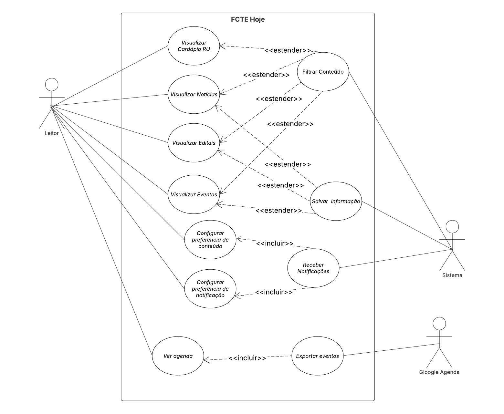
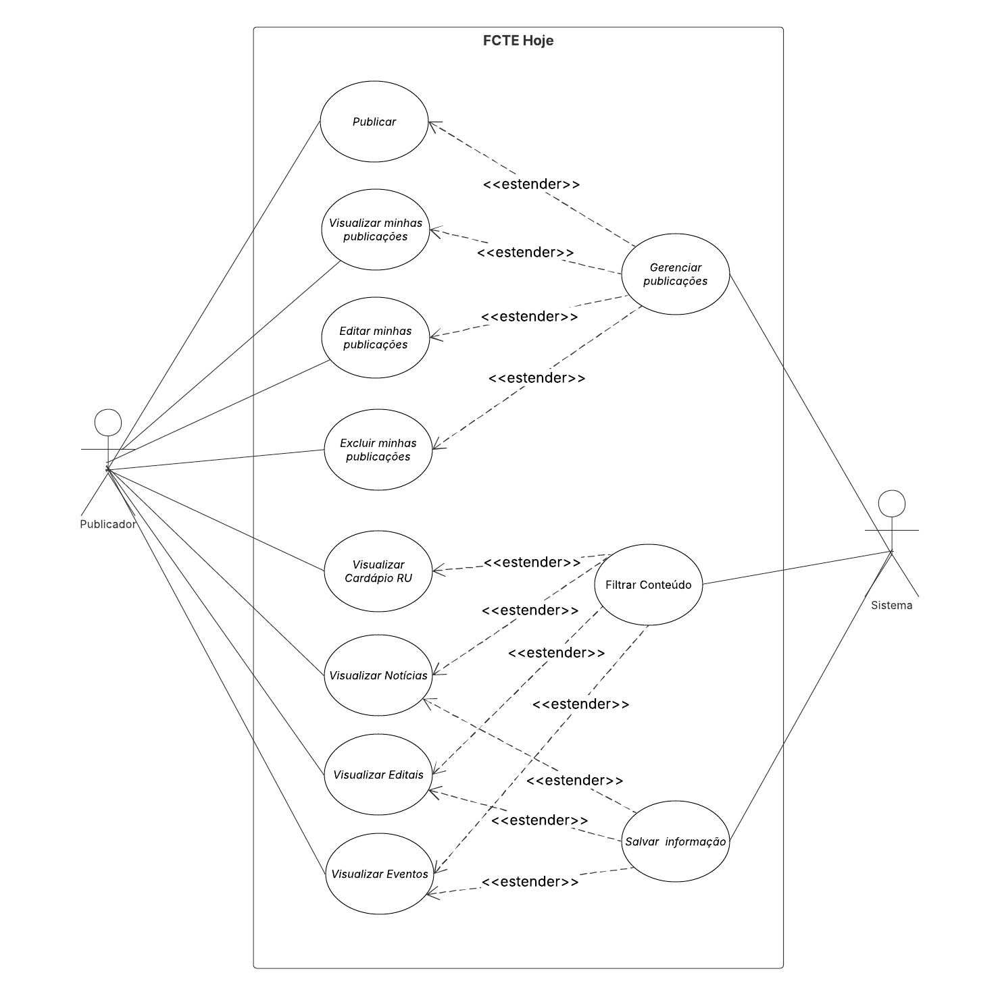

# 2.3.1 Diagrama de Casos de Uso

## Introdução 

Os casos de uso são uma técnica de descoberta de requisitos introduzida inicialmente no método Objectory (JACOBSON et al., 1993). Eles já se tornaram uma característica fundamental da linguagem de modelagem unificada (UML — do inglês unified modeling language). Em sua forma mais simples, um caso de uso identifica os atores envolvidos em uma interação e dá nome ao tipo de interação. Essa é, então, suplementada por informações adicionais que descrevem a interação com o sistema. A informação adicional pode ser uma descrição textual ou um ou mais modelos gráficos, como diagrama de sequência ou de estados da UML. *(SOMMERVILLE, 2011, p. 74)*

## Participantes

| Aluno  | Participação|
| -- | -- |
|  Arthur Henrique Vieira |  [Participação na realização do diagrama](https://unbarqdsw2026-1-turma01.github.io/2026.1-T01-_G4_FCTE_Hoje_Entrega_02/#/Modelagem/2.3.1.DiagramaDeCasosDeUso?id=diagrama-de-casos-de-uso) |
|  Arthur Guilherme Aquino Santos |  [Participação na realização do diagrama](https://unbarqdsw2026-1-turma01.github.io/2026.1-T01-_G4_FCTE_Hoje_Entrega_02/#/Modelagem/2.3.1.DiagramaDeCasosDeUso?id=diagrama-de-casos-de-uso) |
|  Kauã Vale Leão |  [Participação na realização do diagrama](https://unbarqdsw2026-1-turma01.github.io/2026.1-T01-_G4_FCTE_Hoje_Entrega_02/#/Modelagem/2.3.1.DiagramaDeCasosDeUso?id=diagrama-de-casos-de-uso) |
|  Tiago Lemes Teixeira | [Participação na realização do diagrama](https://unbarqdsw2026-1-turma01.github.io/2026.1-T01-_G4_FCTE_Hoje_Entrega_02/#/Modelagem/2.3.1.DiagramaDeCasosDeUso?id=diagrama-de-casos-de-uso) |
|  Vilmar José Fagundes  | Criação da documentação e [participação na realização do diagrama](https://unbarqdsw2026-1-turma01.github.io/2026.1-T01-_G4_FCTE_Hoje_Entrega_02/#/Modelagem/2.3.1.DiagramaDeCasosDeUso?id=diagrama-de-casos-de-uso) |

## Objetivo

Seu principal objetivo é representar todas as possíveis interações que serão descritas nos requisitos de sistema, identificar os atores envolvidos em uma interação.

## Metodologia

Para a criação do diagrama, foi utilizada a notação padrão da **UML**. A metodologia consistiu nos seguintes passos:

- **Análise das informações adicionais que descrevem a interação com o sistema:** Foram analisadas a lista de requisitos e os diagramas para compreender a funcionalidade do sistema;
- **Identificação dos Atores:** Definir quem ou o que irá interagir com o sistema;
- **Definir as interações:** O que o sistema vai interagir com os Atores;
- **Realizar a modelagem dos relacionamentos:** Utilização dos relacionamentos *incluir*, *extender* e Generalização para representar as dependências e lógicas entre os casos de uso e atores.

## Diagrama de Casos de Uso

<strong>Figura 1: Diagrama de Casos de Uso do Leitor</strong>

<em>Autor: <a href="https://github.com/ArthurGuilher62">Arthur Guilherme</a>, <a href="https://github.com/arthurhvieira1">Arthur Henrique</a>, <a href="https://github.com/KauaVL">Kauã Vale</a>, <a href="https://github.com/TiagoTeixeira-2005">Tiago Lemes</a> e <a href="https://github.com/VilmarFagundes">Vilmar Fagundes</a></em>

---

<strong>Figura 2: Diagrama de Casos de Uso do Publicador</strong>

<em>Autor: <a href="https://github.com/ArthurGuilher62">Arthur Guilherme</a>, <a href="https://github.com/arthurhvieira1">Arthur Henrique</a>, <a href="https://github.com/KauaVL">Kauã Vale</a>, <a href="https://github.com/TiagoTeixeira-2005">Tiago Lemes</a> e <a href="https://github.com/VilmarFagundes">Vilmar Fagundes</a></em>

## Mapeamento de Casos de Uso

| Ator | Casos de Uso |
| -- | -- |
| **Leitor** | UC01 - Visualizar Cardápio RU   UC02 - Visualizar Notícias   UC03 - Visualizar Editais   UC04 - Visualizar Eventos   UC07 - Configurar preferência de conteúdo   UC08 - Configurar preferência de notificação   UC09 - Receber Notificações   UC10 - Ver agenda |
| **Publicador** | UC01 - Visualizar Cardápio RU   UC02 - Visualizar Notícias   UC03 - Visualizar Editais   UC04 - Visualizar Eventos   UC12 - Publicar   UC13 - Visualizar minhas publicações   UC14 - Editar minhas publicações   UC15 - Excluir minhas publicações |
| **Sistema** | UC05 - Filtrar Conteúdo   UC06 - Salvar informação   UC09 - Receber Notificações   UC16 - Gerenciar publicações |
| **Google Agenda** | UC11 - Exportar eventos |

## Conclusão

A elaboração dos Diagramas de Casos de Uso permitiu consolidar, de forma visual e padronizada pela notação UML, o entendimento das interações previstas no sistema **FCTE Hoje**. A separação em duas perspectivas **Leitor** (Figura 1) e **Publicador** (Figura 2) evidenciou que a aplicação atende a dois perfis de usuário com necessidades distintas: enquanto o Leitor concentra-se no consumo da informação (visualização, busca e acompanhamento de conteúdos), o Publicador atua na produção e gestão dessas informações (criação, edição e moderação de publicações).

## Referências 

> SOMMERVILLE, Ian. Engenharia de software. 9. ed. São Paulo: Pearson Prentice Hall, 2011. Disponível em: [SOMMERVILLE, 2011](https://archive.org/details/sommerville-engenharia-de-software-9a/mode/2up?q=diagrama+caso). Acesso em: 14 abr. 2026.

> Lucid Software Português. Tutorial de Caso de Uso UML. Youtube, 25 abr. 2019. Disponível em: [https://youtu.be/ab6eDdwS3rA?si=geKJuyxRkgBXmeJE](https://youtu.be/ab6eDdwS3rA?si=geKJuyxRkgBXmeJE). Acesso em: 14 abr. 2026.

| Versão | Data | Descrição | Autor(es) | Revisor(es) | Data da revisão |
|--------|------|-----------|-----------|-------------|-----------------|
| `1.0` | 14/04/2026 | Criação do documento. | [Vilmar Fagundes](https://github.com/VilmarFagundes) | [Tiago Lemes](https://github.com/TiagoTeixeira-2005) | 14/04/2026 |
| `1.1` | 21/04/2026 | Adição das imagens dos Diagramas de Casos de Uso. | [Tiago Lemes](https://github.com/TiagoTeixeira-2005) | [Vilmar Fagundes](https://github.com/VilmarFagundes) | 21/04/2026 |
| `1.2` | 22/04/2026 | Adição da Conclusão. | [Kauã Vale](https://github.com/KauaVL) | | |
