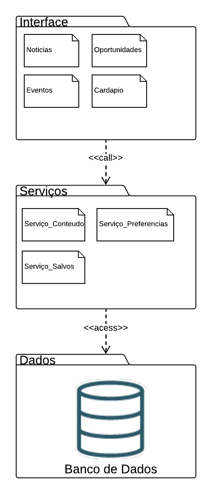

# 2.3.2 Diagrama de Pacotes

# Diagrama de Pacotes

## Introdução

Os diagramas de pacotes são uma forma de diagrama estrutural da UML usados para representar a estrutura de sistemas em termos de pacotes. Eles ajudam a organizar e visualizar a arquitetura de um sistema, agrupando elementos relacionados dentro de pacotes e representando as interações entre eles. Cada pacote pode conter diagramas, documentos, classes ou outros pacotes, sendo representado visualmente como uma pasta de arquivo em um diagrama hierárquico.

Eles desempenham um papel essencial em projetos de software, especialmente na modelagem de sistemas complexos, onde fornecem uma visão clara e organizada da estrutura hierárquica e das dependências entre os componentes.

## Participantes

| Aluno  | Participação |
| -- | -- |
| Arthur Gomes | Participação na [elaboração do diagrama](https://unbarqdsw2026-1-turma01.github.io/2026.1-T01-_G4_FCTE_Hoje_Entrega_02/#/Modelagem/2.3.2.DiagramaDePacotes?id=diagrama-de-pacotes-1) |
| Felipe Guimarães | Participação na [elaboração do diagrama](https://unbarqdsw2026-1-turma01.github.io/2026.1-T01-_G4_FCTE_Hoje_Entrega_02/#/Modelagem/2.3.2.DiagramaDePacotes?id=diagrama-de-pacotes-1) e documentação |
| Felipe Matheus | Participação na [elaboração do diagrama](https://unbarqdsw2026-1-turma01.github.io/2026.1-T01-_G4_FCTE_Hoje_Entrega_02/#/Modelagem/2.3.2.DiagramaDePacotes?id=diagrama-de-pacotes-1) e documentação |
| Felipe Lopes Pedroza | Participação na [elaboração do diagrama](https://unbarqdsw2026-1-turma01.github.io/2026.1-T01-_G4_FCTE_Hoje_Entrega_02/#/Modelagem/2.3.2.DiagramaDePacotes?id=diagrama-de-pacotes-1) e documentação |
| Pedro Miguel | Participação na [elaboração do diagrama](https://unbarqdsw2026-1-turma01.github.io/2026.1-T01-_G4_FCTE_Hoje_Entrega_02/#/Modelagem/2.3.2.DiagramaDePacotes?id=diagrama-de-pacotes-1) |

## Metodologia

O diagrama de pacotes foi elaborado seguindo os padrões da **UML (Unified Modeling Language)** com o objetivo de representar a organização lógica e a hierarquia estrutural do sistema. Diferente de diagramas comportamentais, esta modelagem foca na modularização e no encapsulamento das responsabilidades do software.

A estruturação foi dividida em camadas (Interface, Serviços e Dados), permitindo visualizar como os subsistemas interagem entre si através de relações de dependência

A modelagem priorizou a coesão dos componentes (como Notícias, Eventos e Cardápio) e o baixo acoplamento entre as camadas, garantindo uma arquitetura escalável e organizada. A ferramenta utilizada para o desenvolvimento deste desenho estrutural foi o **Lucidchart**.

## Diagrama de Pacotes

<strong>Figura 1: Diagrama de Pacotes</strong>

<em>Autor: <a href="https://github.com/arthurgomes1290">Arthur Gomes</a>, <a href="https://github.com/felipegf1">Felipe Guimarães</a>, <a href="https://github.com/darkymeubem">Felipe Lopes Pedroza</a>, <a href="https://github.com/femathrl0">Felipe Matheus</a> e <a href="https://github.com/pedromadbr">Pedro Miguel</a></em>

## Descrição do Diagrama

O diagrama de pacotes ilustra a organização lógica do sistema **FCTE Hoje**, estruturada em uma arquitetura de camadas que garante a separação de responsabilidades e facilita a manutenção do software.

### 1. Camada de Interface
O pacote **Interface** representa a camada de apresentação voltada ao usuário final. Ele agrupa os componentes visuais e de interação direta:
* **Componentes:** `Noticias`, `Oportunidades`, `Eventos` e `Cardapio`.
* **Dependência:** Utiliza uma relação de `<<call>>` para acionar a lógica de negócio presente na camada de serviços.

### 2. Camada de Serviços
O pacote **Serviços** atua como o intermediário (Middleware), contendo a lógica de negócio e o processamento de regras do sistema:
* **Componentes:** * `Serviço_Conteúdo`: Gerencia a lógica de distribuição das informações.
    * `Serviço_Preferencias`: Trata as configurações e personalizações do usuário.
    * `Serviço_Salvos`: Gerencia os itens marcados ou favoritos pelo usuário.
* **Dependência:** Utiliza uma relação de `<<access>>` para buscar ou persistir informações na camada de dados.

### 3. Camada de Dados
O pacote **Dados** é a base da estrutura, responsável pela persistência permanente das informações:
* **Componente:** Representado pelo `Banco de Dados`, que centraliza todo o repositório de informações consumido pelas camadas superiores.

---
**Resumo de Design:** O sistema segue um fluxo top-down, onde a interface depende dos serviços e os serviços dependem dos dados. Essa estrutura modular permite que alterações na interface não afetem diretamente o banco de dados e vice-versa.

## Referências Bibliográficas

> LUCIDCHART. O que é um diagrama de comunicação UML. Disponível em: [Lucidchart](https://www.lucidchart.com/). Acesso em: 22 abr. 2026.
> 
>
> WHAT IS COMMUNICATION DIAGRAM?. UML Communication Diagrams. [What is Communication Diagram?](https://www.visual-paradigm.com/guide/uml-unified-modeling-language/what-is-communication-diagram/). Acesso em: 22 abr. 2026.

## Histórico de versões

| Versão | Data | Descrição | Autor(es) | Revisor(es) | Data da revisão |
|--------|------|-----------|-----------|-------------|-----------------|
| `1.0` | 23/04/2026 | Criação e revisão da documentação do diagrama de pacotes. | Felipe Guimaraes | Felipe Matheus | 23/04/2026 |
