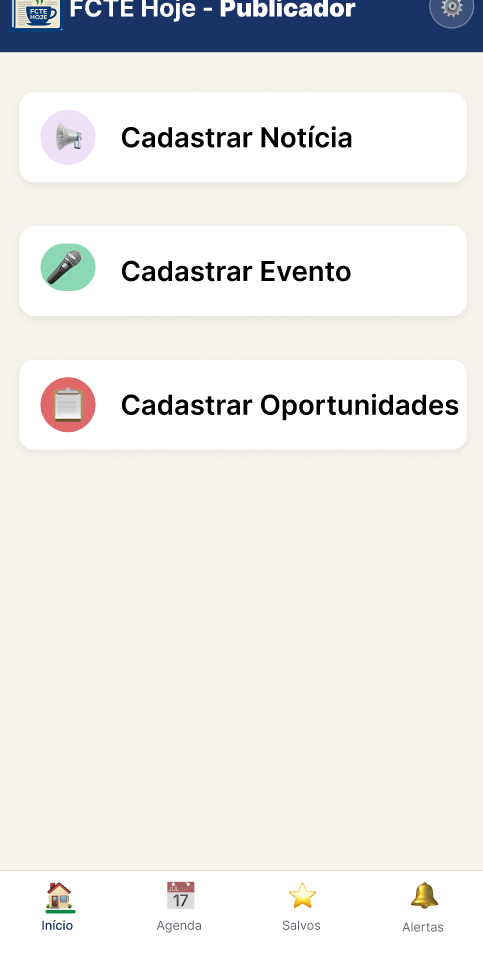
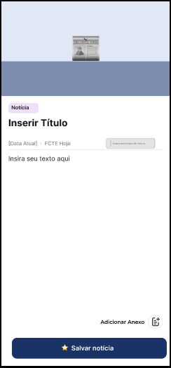
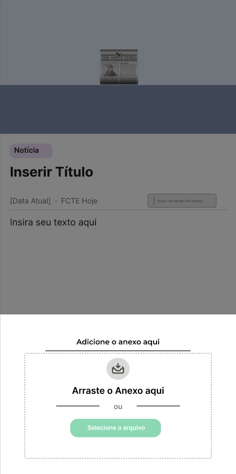
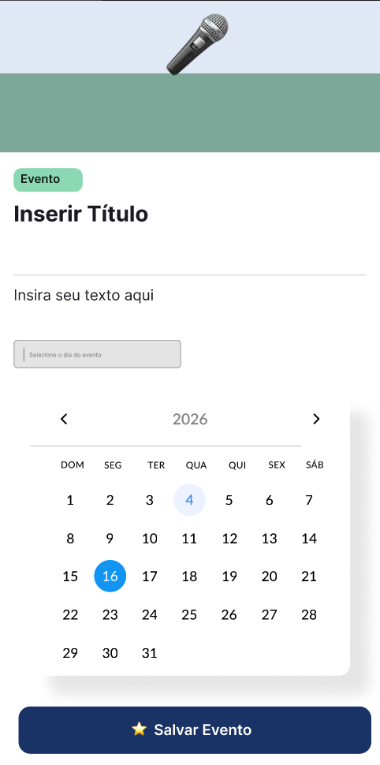
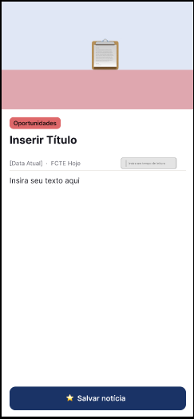

# 2.5.4. Extras — Protótipo (Figma)

## Introdução

Esta página documenta um **extra** da entrega: o **protótipo de média fidelidade** do **FCTE Hoje** no **Figma**, com foco nos fluxos do **publicador** (cadastro de notícias, eventos e oportunidades) e nos respectivos formulários de criação de conteúdo. O objetivo é registrar o link oficial do arquivo, evidenciar a evolução visual da interface e manter rastreabilidade da contribuição individual.

O protótipo completo está disponível em: [FCTE Hoje — Protótipo Média Fidelidade (Figma)](https://www.figma.com/design/9KgeJE79i9UvOKBoeFGhSX/FCTE-Hoje-%E2%80%94-Prot%C3%B3tipo-M%C3%A9dia-Fidelidade?node-id=0-1&t=ZM8vigKBLFfbITUw-1).

## Participantes

| Aluno | Participação |
| :--- | :--- |
| [Felipe Pedroza](https://github.com/darkymeubem) | Incrementos no protótipo de média fidelidade no Figma (telas do publicador, fluxos de notícia, evento e oportunidades); capturas e documentação desta página. |

## Conteúdo do protótipo (prévia)

As figuras abaixo são capturas de telas do arquivo no Figma e ilustram parte do trabalho documentado neste extra.

<strong>Figura 1: Painel do publicador — atalhos principais</strong>

<em>Autor: <a href="https://github.com/darkymeubem">Felipe Pedroza</a></em>

<strong>Figura 2: Cadastro de notícia — estrutura do formulário</strong>

<em>Autor: <a href="https://github.com/darkymeubem">Felipe Pedroza</a></em>

<strong>Figura 3: Cadastro de notícia — fluxo de anexo</strong>

<em>Autor: <a href="https://github.com/darkymeubem">Felipe Pedroza</a></em>

<strong>Figura 4: Cadastro de evento — seleção de data no calendário</strong>

<em>Autor: <a href="https://github.com/darkymeubem">Felipe Pedroza</a></em>

<strong>Figura 5: Cadastro de oportunidades — formulário e ações</strong>

<em>Autor: <a href="https://github.com/darkymeubem">Felipe Pedroza</a></em>

## Referência

> FIGMA. *FCTE Hoje — Protótipo Média Fidelidade*. Disponível em: [link do projeto no Figma](https://www.figma.com/design/9KgeJE79i9UvOKBoeFGhSX/FCTE-Hoje-%E2%80%94-Prot%C3%B3tipo-M%C3%A9dia-Fidelidade?node-id=0-1&t=ZM8vigKBLFfbITUw-1). Acesso em: 24 abr. 2026.

## Histórico de versões

| Versão | Data | Descrição | Autor(es) | Revisor(es) | Data da revisão |
|--------|------|-----------|-----------|-------------|-----------------|
| `1.0` | 24/04/2026 | Criação da página Extras com link ao Figma e figuras do protótipo. | [Felipe Pedroza](https://github.com/darkymeubem) | — | — |
| `1.1` | 24/04/2026 | Centralização das figuras na prévia do protótipo. | [Felipe Pedroza](https://github.com/darkymeubem) | — | — |
